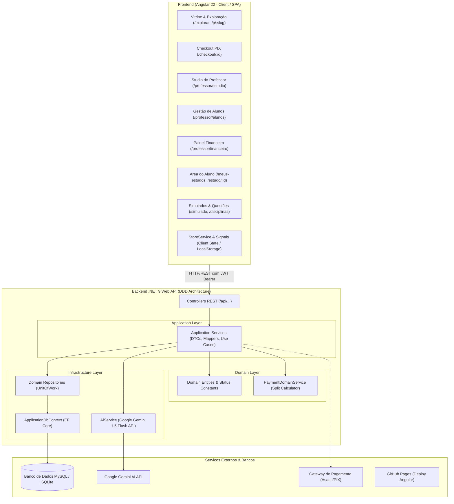
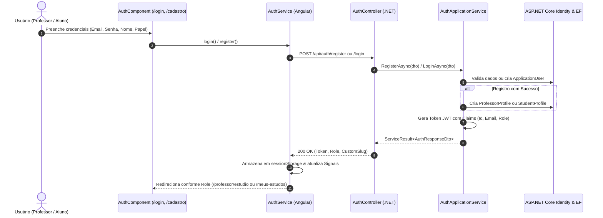
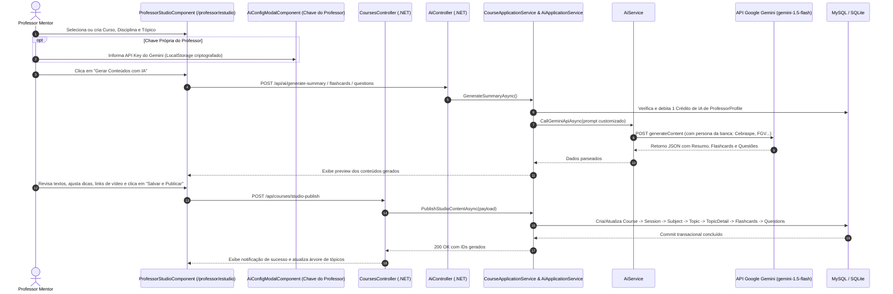
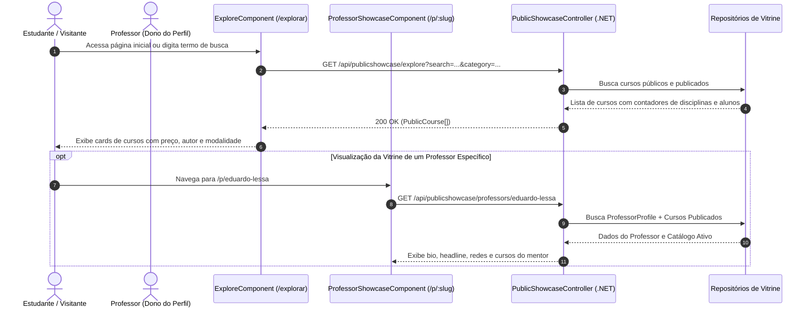
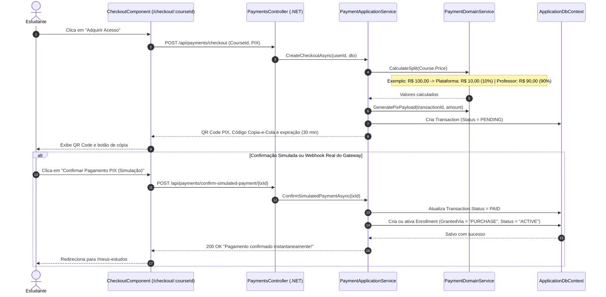
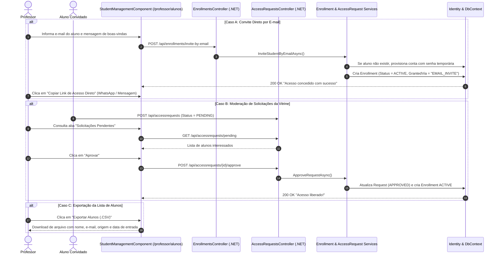
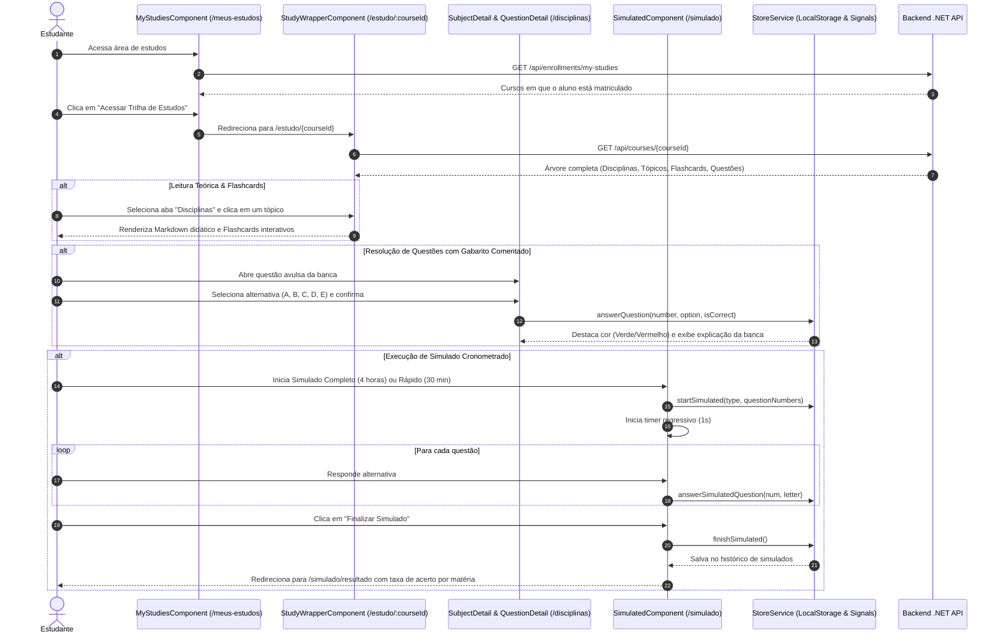
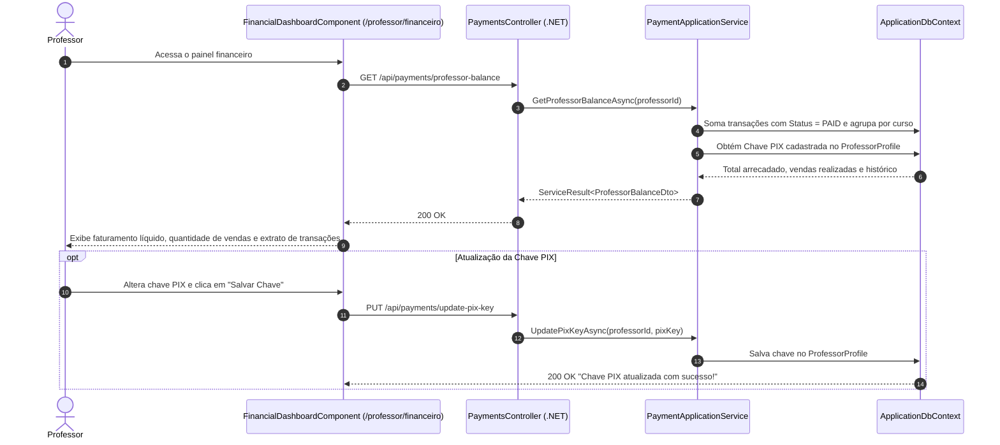
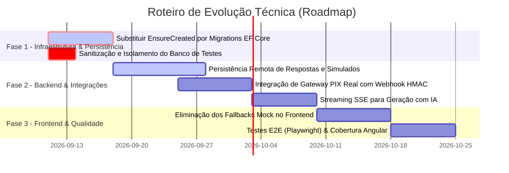

# 📋 Documentação Completa da Plataforma TeacherTech / Concurso Dev

Esta documentação apresenta a análise técnica aprofundada do projeto **TeacherTech / Concurso Dev**, detalhando sua arquitetura monorepo, todas as entidades relacionais, os fluxos operacionais de ponta a ponta com diagramação Mermaid, a matriz de integração entre Angular e .NET 9, e o roteiro de evolução técnica (TODOs prioritários).

---

## 1. Visão Geral da Arquitetura do Sistema

O projeto é estruturado como um **Monorepo** unificado que combina um frontend moderno em **Angular 22 (Standalone Components + Signals)** e um backend robusto em **.NET 9 (C#)** orientado aos princípios de **Domain-Driven Design (DDD)**, com pipeline automatizado via **GitHub Actions** e deploy estático no **GitHub Pages**.



---

## 2. Modelo Relacional e Entidades de Domínio

O domínio foi modelado com alta coesão e integridade referencial dentro do `ApplicationDbContext.cs`, suportando a hierarquia completa de ensino: **Curso -> Módulo/Sessão -> Disciplina -> Tópico -> Detalhes -> Flashcards / Questões / Cronograma / Simulados**.

### 2.1 Diagrama Entidade-Relacionamento (ERD)

```mermaid
erDiagram
    ApplicationUser ||--o| ProfessorProfile : "possui (1:1)"
    ApplicationUser ||--o| StudentProfile : "possui (1:1)"
    ApplicationUser ||--o{ CourseStudyPlan : "é autor de (1:N)"
    ApplicationUser ||--o{ Enrollment : "estuda em (1:N)"
    ApplicationUser ||--o{ AccessRequest : "solicita (1:N)"
    ApplicationUser ||--o{ Transaction : "paga por (1:N)"

    CourseStudyPlan ||--o{ StudySession : "possui (1:N)"
    CourseStudyPlan ||--o{ Subject : "possui (1:N)"
    CourseStudyPlan ||--o{ StudySchedule : "define rotina de (1:N)"
    CourseStudyPlan ||--o{ SimulatedTest : "disponibiliza (1:N)"
    CourseStudyPlan ||--o{ Enrollment : "tem matriculados (1:N)"
    CourseStudyPlan ||--o{ AccessRequest : "recebe pedidos de (1:N)"
    CourseStudyPlan ||--o{ Transaction : "gera receitas via (1:N)"

    StudySession ||--o{ Subject : "agrupa (1:N opcional)"

    Subject ||--o{ Topic : "contém (1:N)"

    Topic ||--o| TopicDetail : "detalha formalmente (1:1)"
    Topic ||--o{ Flashcard : "gera para revisão (1:N)"
    Topic ||--o{ Question : "possui banco de (1:N)"

    SimulatedTest ||--o{ SimulatedQuestion : "compõe prova de (1:N)"

    Enrollment ||--o{ Transaction : "vincula transação (1:1 opcional)"

    ApplicationUser {
        string Id PK
        string FullName
        string Email
        string UserRole "ADMIN | PROFESSOR | STUDENT"
        string AvatarUrl
        datetime CreatedAt
    }

    ProfessorProfile {
        string UserId PK_FK
        string Headline
        string Bio
        string PixKey
        string CustomSlug UK
        int AiCreditsLimit
        int AiCreditsUsed
        bool PublicVisibility
    }

    StudentProfile {
        string UserId PK_FK
        string GoalExam
        string Bio
    }

    CourseStudyPlan {
        guid Id PK
        string ProfessorId FK
        string Title
        string Description
        string Category
        decimal Price
        bool IsPublic
        string Status "DRAFT | PUBLISHED | ARCHIVED"
        string CoverImageUrl
    }

    StudySession {
        guid Id PK
        guid CourseId FK
        string Name
        int OrderIndex
    }

    Subject {
        guid Id PK
        guid CourseId FK
        guid SessionId FK "nullable"
        string Name
        string Meta
        string Description
        int OrderIndex
    }

    Topic {
        guid Id PK
        guid SubjectId FK
        string Title
        string ContentMarkdown
        string ExamBoard
        int OrderIndex
    }

    TopicDetail {
        guid Id PK
        guid TopicId FK_UK
        string Title
        string Summary
        string Detail
        string Peso
        json ExamplesJson
        json KeyPointsJson
        json TipsJson
        json UsefulLinksJson
    }

    Flashcard {
        guid Id PK
        guid TopicId FK
        string FrontText
        string BackText
        string Difficulty "EASY | MEDIUM | HARD"
    }

    Question {
        guid Id PK
        guid TopicId FK
        string Statement
        json OptionsJson
        int CorrectOptionIndex
        string Explanation
        string ExamBoard
    }

    StudySchedule {
        guid Id PK
        guid CourseId FK
        int WeekNumber
        string DayOfWeek
        string SubjectName
        string TopicTitle
        int GoalMinutes
        string Notes
    }

    SimulatedTest {
        guid Id PK
        guid CourseId FK
        string Title
        string Description
        int TimeLimitMinutes
    }

    SimulatedQuestion {
        guid Id PK
        guid SimulatedTestId FK
        string Statement
        json OptionsJson
        int CorrectOptionIndex
        string Explanation
        string ExamBoard
    }

    Enrollment {
        guid Id PK
        string StudentId FK
        guid CourseId FK
        string GrantedBy
        string GrantedVia "EMAIL_INVITE | PUBLIC_ACCESS | PURCHASE"
        string Status "ACTIVE | SUSPENDED | EXPIRED"
        datetime CreatedAt
    }

    AccessRequest {
        guid Id PK
        string StudentId FK
        guid CourseId FK
        string Message
        string Status "PENDING | APPROVED | REJECTED"
        datetime RequestedAt
    }

    Transaction {
        guid Id PK
        string UserId FK
        guid CourseId FK
        guid EnrollmentId FK "nullable"
        decimal Amount
        decimal PlatformFee
        decimal ProfessorRevenue
        string PaymentGateway
        string GatewayTransactionId
        string Status "PENDING | PAID | REFUNDED | FAILED"
    }
```

### 2.2 Dicionário de Entidades e Regras de Negócio

| Entidade | Arquivo de Origem | Chaves & Índices | Regras de Negócio Associadas |
| :--- | :--- | :--- | :--- |
| **`ApplicationUser`** | `DomainEntities.cs` | PK: `Id` | Herda de `IdentityUser`. Possui papel de acesso (`ADMIN`, `PROFESSOR`, `STUDENT`). |
| **`ProfessorProfile`** | `DomainEntities.cs` | PK/FK: `UserId`<br>Index: `CustomSlug` | Controla cota de geração por IA (`AiCreditsUsed` vs `AiCreditsLimit`), chave PIX para comissões e URL pública (`/p/:slug`). |
| **`StudentProfile`** | `DomainEntities.cs` | PK/FK: `UserId` | Armazena o concurso alvo (`GoalExam`) e histórico de estudos. |
| **`CourseStudyPlan`** | `DomainEntities.cs` | PK: `Id`<br>FK: `ProfessorId` | Raiz agregadora de conteúdo. Pode ser gratuito (`Price = 0.00`) ou pago, público ou privado. |
| **`StudySession`** | `DomainEntities.cs` | PK: `Id`<br>FK: `CourseId` | Agrupador pedagógico de disciplinas (ex.: "Conhecimentos Específicos", "Conhecimentos Gerais"). |
| **`Subject`** | `DomainEntities.cs` | PK: `Id`<br>FK: `CourseId`, `SessionId`<br>UK: `(CourseId, Name)` | Disciplina formal do edital com peso e meta de estudo. |
| **`Topic`** | `DomainEntities.cs` | PK: `Id`<br>FK: `SubjectId`<br>UK: `(SubjectId, Title)` | Ponto específico do edital. Armazena resumo teórico em Markdown e banca examinadora. |
| **`TopicDetail`** | `DomainEntities.cs` | PK: `Id`<br>FK/UK: `TopicId` | Detalhes avançados: exemplos de aplicação, dicas de prova, links do YouTube e pontos-chave serializados em JSON. |
| **`Flashcard`** | `DomainEntities.cs` | PK: `Id`<br>FK: `TopicId` | Cartões de memorização com pergunta/resposta (`FrontText`/`BackText`) e dificuldade (`EASY`, `MEDIUM`, `HARD`). |
| **`Question`** | `DomainEntities.cs` | PK: `Id`<br>FK: `TopicId` | Questões de múltipla escolha com enunciado, alternativas em JSON, gabarito e resolução comentada. |
| **`StudySchedule`** | `DomainEntities.cs` | PK: `Id`<br>FK: `CourseId` | Planejamento semanal por dia com metas de tempo em minutos. |
| **`SimulatedTest`** | `DomainEntities.cs` | PK: `Id`<br>FK: `CourseId` | Simulado com cronômetro regressivo (`TimeLimitMinutes`) e questões inéditas. |
| **`Enrollment`** | `DomainEntities.cs` | PK: `Id`<br>FK: `StudentId`, `CourseId` | Matrícula do aluno. Concedida via compra (`PURCHASE`), convite (`EMAIL_INVITE`) ou aprovação de pedido (`PUBLIC_ACCESS`). |
| **`AccessRequest`** | `DomainEntities.cs` | PK: `Id`<br>FK: `StudentId`, `CourseId` | Pedido de acesso aberto pelo aluno ao visualizar um curso com vagas restritas. |
| **`Transaction`** | `DomainEntities.cs` | PK: `Id`<br>FK: `UserId`, `CourseId`, `EnrollmentId` | Registro financeiro de compra com split automático: **90% para o professor e 10% de taxa da plataforma**. |

---

## 3. Mapeamento dos Fluxos Operacionais Implementados

### 3.1 Fluxo de Autenticação, Registro e RBAC
Responsável por gerenciar acesso seguro com tokens JWT, perfis diferenciados de Professor e Aluno e credenciais padrão semeadas no arranque.



---

### 3.2 Fluxo do Professor Studio & Geração por IA (Google Gemini)
O Studio é o ambiente onde o professor monta trilhas hierárquicas completas. O professor pode redigir ou solicitar geração automática com IA (Gemini 1.5 Flash) de resumos teóricos, flashcards e questões, salvando toda a árvore no banco de dados com uma única operação.



---

### 3.3 Fluxo da Vitrine Pública & Exploração de Conteúdos
Permite aos estudantes e visitantes navegarem pelos cursos disponíveis, buscarem por palavra-chave ou categoria e visualizarem o perfil de autor de professores via custom slug (`/p/:slug`).



---

### 3.4 Fluxo de Checkout, Split Financeiro e Confirmação PIX
Para cursos com valor definido (`Price > 0`), o sistema gera uma ordem de pagamento via PIX com cálculo automático de divisão de receita (90% professor, 10% plataforma) e liberação instantânea da matrícula.



---

### 3.5 Fluxo de Gestão de Alunos pelo Professor
Permite ao professor gerenciar o acesso às suas turmas através de 3 mecanismos: convite por e-mail, compartilhamento de link direto e aprovação/rejeição de pedidos de acesso da vitrine.



---

### 3.6 Fluxo de Estudo do Aluno (Study Wrapper, Simulado e Questões)
O aluno matriculado acessa suas trilhas em `/meus-estudos` e navega pelo `StudyWrapperComponent`, com acesso a resumos teóricos, cartões de memorização e simulados com cronômetro.



---

### 3.7 Fluxo Financeiro do Professor
Permite ao professor acompanhar em tempo real o saldo disponível gerado pelas vendas de seus cursos e cadastrar sua chave PIX de repasse.



---

## 4. Matriz de Integração (Frontend Angular vs. Backend .NET 9)

| Rota Frontend (Angular) | Componente Angular | Serviço Frontend | Endpoint Backend (.NET 9) | Método | Entidades Manipuladas |
| :--- | :--- | :--- | :--- | :--- | :--- |
| `/login`, `/cadastro` | `AuthComponent` | `AuthService` | `/api/auth/register`<br>`/api/auth/login` | POST | `ApplicationUser`<br>`ProfessorProfile`<br>`StudentProfile` |
| `/explorar` | `ExploreComponent` | `PublicShowcaseService` | `/api/publicshowcase/explore` | GET | `CourseStudyPlan`<br>`Subject` |
| `/p/:slug` | `ProfessorShowcaseComponent` | `PublicShowcaseService` | `/api/publicshowcase/professors/{slug}` | GET | `ProfessorProfile`<br>`CourseStudyPlan` |
| `/checkout/:courseId` | `CheckoutComponent` | `PaymentService` | `/api/payments/checkout`<br>`/confirm-simulated-payment/{id}` | POST | `Transaction`<br>`Enrollment` |
| `/professor/estudio` | `ProfessorStudioComponent` | `ProfessorStudioService`<br>`AiGeneratorService` | `/api/ai/generate-...`<br>`/api/courses/studio-publish` | POST | `CourseStudyPlan`<br>`StudySession`<br>`Subject`<br>`Topic`<br>`TopicDetail`<br>`Flashcard`<br>`Question`<br>`SimulatedTest` |
| `/professor/alunos` | `StudentManagementComponent` | `StudentManagementService` | `/api/enrollments/invite-by-email`<br>`/api/accessrequests/pending`<br>`/api/accessrequests/{id}/approve` | POST<br>GET | `Enrollment`<br>`AccessRequest`<br>`ApplicationUser` |
| `/professor/financeiro` | `FinancialDashboardComponent` | `PaymentService` | `/api/payments/professor-balance`<br>`/api/payments/update-pix-key` | GET<br>PUT | `Transaction`<br>`ProfessorProfile` |
| `/meus-estudos` | `MyStudiesComponent` | `StudentManagementService` | `/api/enrollments/my-studies` | GET | `Enrollment`<br>`CourseStudyPlan` |
| `/estudo/:courseId` | `StudyWrapperComponent` | `CoursesService` | `/api/courses/{id}` | GET | Toda a árvore hierárquica do curso |
| `/disciplinas`, `/simulado` | `SubjectDetailComponent`<br>`SimulatedComponent` | `StoreService` | *Armazenamento Local (Client-side)* | N/A | `LocalStorage` (respostas, progresso e simulados) |

---

## 5. Diagnóstico Atual do Projeto & TODOs Prioritários para Evolução

A plataforma já possui a espinha dorsal de negócio implementada (cadastro, geração com IA, publicação hierárquica no banco, vitrine, split de pagamentos e gestão de alunos). No entanto, foram identificados pontos de evolução e débitos técnicos críticos para transformar a aplicação em um SaaS escalável de produção.

### 5.1 Tabela de TODOs e Gaps Identificados



### 5.2 Detalhamento dos TODOs

#### 🔴 Prioridade Crítica (P1 - Bloqueadores de Produção e Qualidade)
1. **Migrações Formais do EF Core (`dotnet ef migrations`)**:
   - **Cenário atual**: `Program.cs:L205` utiliza `await dbContext.Database.EnsureCreatedAsync()`. Quando o modelo de domínio evoluiu (por exemplo, com a inclusão da coluna `Meta` na entidade `Subject`), o banco local SQLite de testes não atualizou seu esquema, gerando o erro identificado na suíte de testes: `SQLite Error 1: 'table Subjects has no column named Meta'`.
   - **Ação**: Instalar as ferramentas do EF Core, rodar `dotnet ef migrations add InitialModel` e substituir `EnsureCreatedAsync` por `await dbContext.Database.MigrateAsync()` em ambientes com banco relacional gerenciado.
2. **Isolamento e Limpeza Automática do Banco de Testes**:
   - **Cenário atual**: `CustomWebApplicationFactory.cs` reaproveita o arquivo `teachertech_test.db` no disco sem limpá-lo entre execuções ou utilizar SQLite em memória (`DataSource=:memory:` com conexão aberta persistente).
   - **Ação**: Configurar `SqliteConnection("DataSource=:memory:")` aberta durante a vida útil do teste ou deletar o arquivo `.db` ao inicializar a suíte de testes unitários/integrados.

#### 🟠 Prioridade Alta (P2 - Experiência do Usuário e Segurança)
3. **Persistência Remota do Progresso do Estudante (API REST)**:
   - **Cenário atual**: O `StoreService.ts` grava respostas de questões (`dataprev_answers`), sessões de simulado ativas (`dataprev_simulated`) e histórico de pontuação (`dataprev_history`) exclusivamente no `localStorage` do navegador. Se o estudante trocar de dispositivo ou limpar o cache, todo o progresso é perdido.
   - **Ação**: Criar entidades `StudentQuestionAnswer` e `StudentSimulatedAttempt` no backend com endpoints correspondentes (`POST /api/progress/answers`, `POST /api/progress/simulated`).
4. **Integração Real do Gateway de Pagamento (Asaas / Mercado Pago)**:
   - **Cenário atual**: O `PaymentService.cs` gera um payload sintético estático (`00020126580014BR.GOV.BCB.PIX...`) e a confirmação é simulada manualmente via botão na tela.
   - **Ação**: Implementar client HTTP para a API oficial do Asaas/Mercado Pago, com geração de cobrança Pix dinâmica real e webhook com assinatura criptográfica (`HMAC-SHA256`) para liberação segura das matrículas.

#### 🟡 Prioridade Média (P3 - Escalabilidade e IA)
5. **Streaming Server-Sent Events (SSE) na Geração com Gemini**:
   - **Cenário atual**: O resumo completo em Markdown é gerado em uma única requisição síncrona, que pode demorar entre 5 a 15 segundos, gerando espera para o professor.
   - **Ação**: Implementar endpoint com streaming de texto contínuo no backend (`IAsyncEnumerable<string>`) e consumo via `fetch`/`EventSource` no frontend, exibindo o texto sendo digitado em tempo real.
6. **Desacoplamento e Redução do Bundle Frontend (Remoção do `topics.data.ts`)**:
   - **Cenário atual**: O arquivo `topics.data.ts` possui **mais de 328 KB de dados embutidos** no bundle JavaScript final do Angular.
   - **Ação**: Migrar essa massa de dados para o banco de dados via script de seed e consumir sob demanda através do endpoint `GET /api/topics/{id}`, reduzindo o First Contentful Paint (FCP) da aplicação.
7. **Refresh Tokens e Expiração Dinâmica**:
   - **Cenário atual**: O token JWT possui validade estática de 7 dias sem mecanismo de renovação silenciosa (*refresh token*).
   - **Ação**: Implementar tabela de `RefreshToken` vinculada a `ApplicationUser` com rota `POST /api/auth/refresh-token`.

---

## 6. Conclusão e Próximos Passos Recomendados

A arquitetura do projeto encontra-se em um nível avançado de organização: o monorepo está estruturado de forma coesa, o backend segue padrões sólidos de DDD com segregação de responsabilidades e injeção de dependência limpa, e o frontend Angular utiliza recursos modernos como Signals, Standalone Components e interceptors HTTP.

**Recomendação para a próxima sprint de desenvolvimento:**
1. **Passo 1**: Excluir o arquivo residual `teachertech_test.db` e adicionar migrações do EF Core para que os testes de integração do backend voltem a ter 100% de aprovação imediata.
2. **Passo 2**: Implementar o salvamento em banco das respostas do aluno (eliminando a dependência estrita do `localStorage`).
3. **Passo 3**: Plugar as credenciais de Sandbox do gateway de pagamentos no `PaymentService`.
