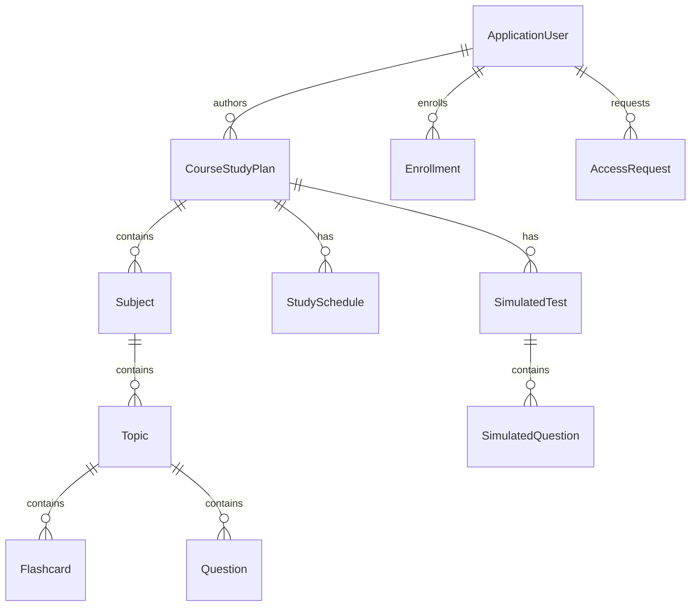

# Concurso Dev · Plataforma de Planos de Estudo & Mentorias TI

Uma solução full-stack moderna composta por um **Frontend em Angular 19** e um **Backend em .NET 8 C# (EF Core + MySQL)** com autenticação JWT, integração com IA para geração de conteúdo didático e um modelo de dados relacional inteiramente normalizado.

---

## 🎯 Arquitetura Geral

A aplicação é dividida em arquitetura limpa:

- **Frontend (`angular-app/`)**: Desenvolvido em Angular 19 com Standalone Components, Angular Signals para reatividade dinâmica, SCSS modular e integração unificada via `environment.apiUrl`.
- **Backend (`backend/`)**: Desenvolvido em .NET 8 (C#) seguindo Clean Architecture:
  - `TeacherTech.Domain`: Entidades relacionais de domínio (`CourseStudyPlan`, `Subject`, `Topic`, `Flashcard`, `Question`, `StudySchedule`, `SimulatedTest`, `Enrollment`, `AccessRequest`, `Transaction`).
  - `TeacherTech.Application`: DTOs e contratos de aplicação (`SaveStudioContentDto`, `CourseResponseDto`, etc.).
  - `TeacherTech.Infrastructure`: `ApplicationDbContext`, Entity Framework Core e integrações de banco.
  - `TeacherTech.Api`: Controllers RESTful com JWT Auth, Roles (`PROFESSOR`, `STUDENT`, `ADMIN`) e endpoints de negócios.

---

## 🚀 Fluxos de Usabilidade Implementados

### 👨‍🏫 1. Fluxo do Professor Mentor

1. **Autenticação & Perfil de Mentor**:
   - Cadastro e Login com emissão de token JWT Bearer.
   - Definição de perfil público, headline, bio e slug personalizado (ex: `/professor/joao-silva`).
2. **Studio do Professor (Criação Assistida por IA)**:
   - Configuração do Curso, Disciplina, Tópico e Banca Examinadora (Cebraspe, FGV, FCC, etc.).
   - Geração dinâmica de resumos didáticos em Markdown, flashcards, questões inéditas, cronograma de estudos e simulados.
   - **Persistência Real no MySQL**: O botão *"Salvar e Publicar no Banco MySQL"* dispara uma requisição `POST /api/courses/studio-publish`. O backend executa um salvamento transacional relacional (Unit of Work), vinculando `CourseStudyPlan` ➔ `Subject` ➔ `Topic` ➔ `Flashcard` / `Question`, além das tabelas relacionais de `StudySchedule` e `SimulatedTest`.
3. **Gestão de Alunos & Matrículas**:
   - Envio de convites de acesso via e-mail do aluno (`Enrollment`).
   - Visualização e aprovação/rejeição de solicitações pendentes de acesso (`AccessRequest`).
4. **Painel Financeiro & Vendas**:
   - Acompanhamento de vendas de cursos, comissão do professor vs taxa da plataforma, saldo disponível e cadastro de chave PIX.

---

### 👨‍🎓 2. Fluxo do Aluno Candidato

1. **Vitrine & Exploração de Cursos**:
   - Navegação pela lista pública de cursos criados pelos professores mentores.
   - Filtros por categoria (Desenvolvimento, Arquitetura, Banco de Dados, BI, Governança TI).
2. **Matrícula & Solicitação de Acesso**:
   - Solicitação de acesso a cursos privados com mensagem direta ao mentor.
   - Checkout com simulação de pagamento via PIX.
3. **Painel "Meus Estudos"**:
   - Visualização dos cursos em que o aluno está matriculado.
   - Trilha de estudo por disciplinas e tópicos.
   - Revisão interativa com Flashcards (frente/verso e nível de dificuldade).
   - Resolução de Questões com feedback imediato de gabarito e explicação comentada.
   - Acompanhamento do Cronograma Semanal e realização de Simulados cronometrados.

---

## 🗃️ Estrutura do Banco de Dados (EF Core / MySQL)



---

## 🛠️ Como Executar o Projeto Localmente

### Pré-requisitos
- .NET 8 SDK ou superior
- Node.js 18+ & npm
- Banco MySQL (ou MySQL local/Docker)

### 1. Iniciar o Backend API (.NET C#)
```bash
cd backend/src/TeacherTech.Api
dotnet run
```
A API estará rodando em `http://localhost:5000/api` (Swagger disponível em `http://localhost:5000/swagger`).

### 2. Iniciar o Frontend (Angular 19)
```bash
cd angular-app
npm install
npm start
```
Acesse a aplicação no navegador em `http://localhost:4200/`.

---

## 📝 Testes e Verificação de Build
- Backend: `dotnet build backend/src/TeacherTech.Api/TeacherTech.Api.csproj`
- Frontend: `cd angular-app && npm run build`
